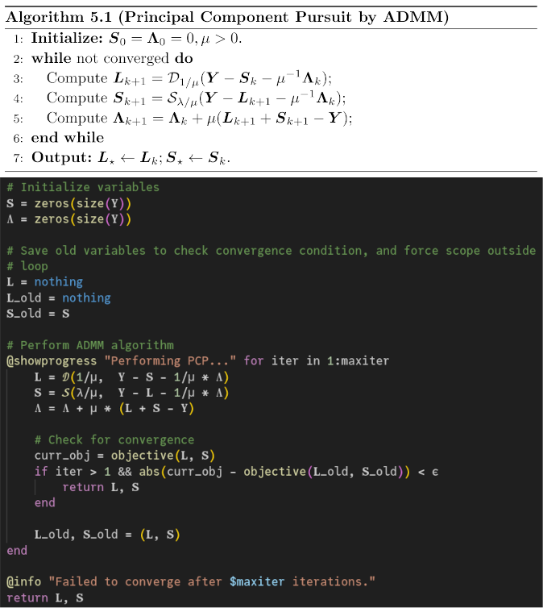

# Principal Component Pursuit
This code is an implementation and demo of Principal Component Pursuit, as applied to an image background extraction problem. The algorithm is based on section 5.2 of John Wright & Yi Ma's *High-Dimensional Data Analysis with Low-Dimensional Models* [Wright & Ma, 2022]. 

The algorithm represents a video as a matrix in which each column is a flattened frame of the video. We assume that the video mostly contains a static background, and a few things moving or changing in the foreground. Using convex optimization, we separate the video matrix into a low-rank component and a sparse component -- or in other words, a background component, and a foreground component.

Here are some results, using the `demo` function in `PCP_demo.jl` (in this repository).The top shows the original video. The middle shows the low-rank component (the background). The bottom shows the sparse component (the foreground, rescaled to the range of grayscale values). The bottom video added to the middle video yields the top video.

### Note on Unicode

The code should be viewed with a font capable of handling mathematical Unicode characters like 𝒮, ϵ, and 𝐕ᵀ. I don't generally code this way, but since Julia offers the support, I thought I'd experiment with making the code match the book's notation. [Not everyone agrees with this practice](https://discourse.julialang.org/t/unicode-a-bad-idea-in-general/). Below is a comparison of the ADMM algorithm pseudocode in Wright & Ma's book and my implementation in `PCP.jl`. Julia makes this kind of mathematical coding easy.

***

Wright, J., & Ma, Y. (2022). High-dimensional data analysis with low-dimensional models: Principles, computation, and applications. Cambridge University Press.
